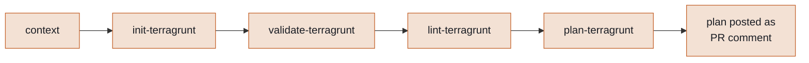
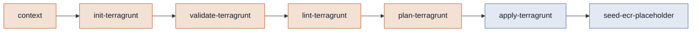

# How the infra pipeline works

One workflow, seven jobs, always run in the same order. What changes is which trigger fired — a PR preview, or a real push. Triggers only when a change touches the `infra/` folder — nothing else wakes this workflow up.

Source: [`.github/workflows/infra.yml`](../.github/workflows/infra.yml)

## Diagram 1 — Pull request workflow

Opening a PR, or pushing a new commit to it, runs four checks and stops — nothing gets applied yet.

Preview only — never applies anything.

## Diagram 2 — Push workflow

A push to dev, qa, or main — which is what a merge actually produces — runs the identical five checks, then applies, then seeds ECR if needed.

Same five checks as the PR workflow, plus apply — which only ever happens here — plus a check that seeds any freshly-created, still-empty ECR repo with a placeholder image, so a brand-new ECS service always has something to pull.

## Job by job

| # | Job | What it does |
|---|-----|---------------|
| 1 | `context` | Figures out the environment — dev, qa, or prod — from the branch name. |
| 2 | `init-terragrunt` | Connects to the S3 state backend — creating the bucket automatically if it doesn't exist yet — and downloads providers. Fails fast if credentials or backend access are broken. |
| 3 | `validate-terragrunt` | Checks the Terraform code is syntactically valid — types, references, structure. |
| 4 | `lint-terragrunt` | Checks formatting (`hcl fmt`) and AWS best-practice rules (`tflint`). |
| 5 | `plan-terragrunt` | Previews exactly what would change. On a PR, posts that preview as a comment for review. |
| 6 | `apply-terragrunt` — *push only* | Actually makes the change. Automatic for dev; waits for a required reviewer on qa/prod, if configured. |
| 7 | `seed-ecr-placeholder` — *push only* | If a service's ECR repo has zero images (a fresh environment's first apply), builds and pushes a placeholder image so its ECS service has something to pull. Never touches a repo that already has a real image. |

---

thor-backend · generated from [`.github/workflows/infra.yml`](../.github/workflows/infra.yml)
